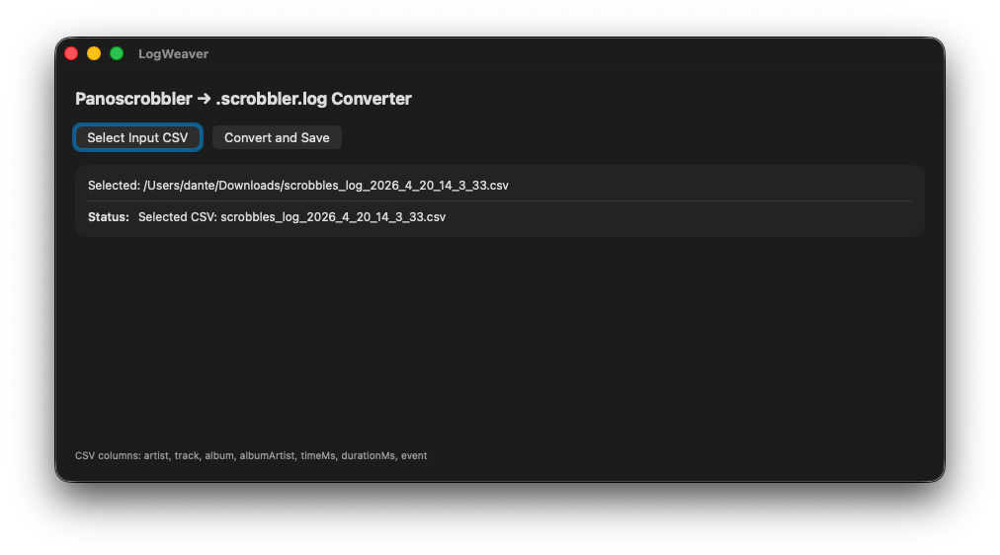

# LogWeaver





**LogWeaver** is a lightweight, native macOS utility designed to convert music listening logs from [Pano Scrobbler](https://github.com/kawaiiDango/pano-scrobbler) into the standard `.scrobbler.log` format.

This format is widely used for importing listening history into services like Last.fm or for use with portable media players running Rockbox.

## ✨ Features

- **Native macOS GUI**: Built with SwiftUI for a fast, responsive, and "system-native" feel.
- **Privacy & Security**: Operates within the App Sandbox. The app only accesses the specific files you explicitly select.
- **Precision**: Handles millisecond-to-second timestamp conversion and preserves album/artist metadata.
- **Clean Code**: No third-party dependencies; uses native Swift APIs for file handling and parsing.

## 🛠 Tech Stack

- **Language**: Swift 6.0
- **Framework**: SwiftUI
- **Platform**: macOS 15.6+ (macOS Sequoia and later)

## 🚀 How to Use

1. **Launch**: Open `LogWeaver.app`.
2. **Select Input**: Click **"Select Input CSV"** and choose your log file exported from Pano Scrobbler (usually named `scrobbles_log_...csv`).
3. **Convert**: Click **"Convert and Save"**. 
4. **Export**: Choose your destination. The app will generate a properly formatted `.scrobbler.log` file.
5. **Done**: Your file is now ready for import!

## 📦 Building from Source

To build the app yourself:

1. Clone the repository:
   
```bash
   git clone [https://github.com/DanteAlighierin/localpanoscrobblertologscrobblergit](https://github.com/DanteAlighierin/localpanoscrobblertologscrobbler.git)
